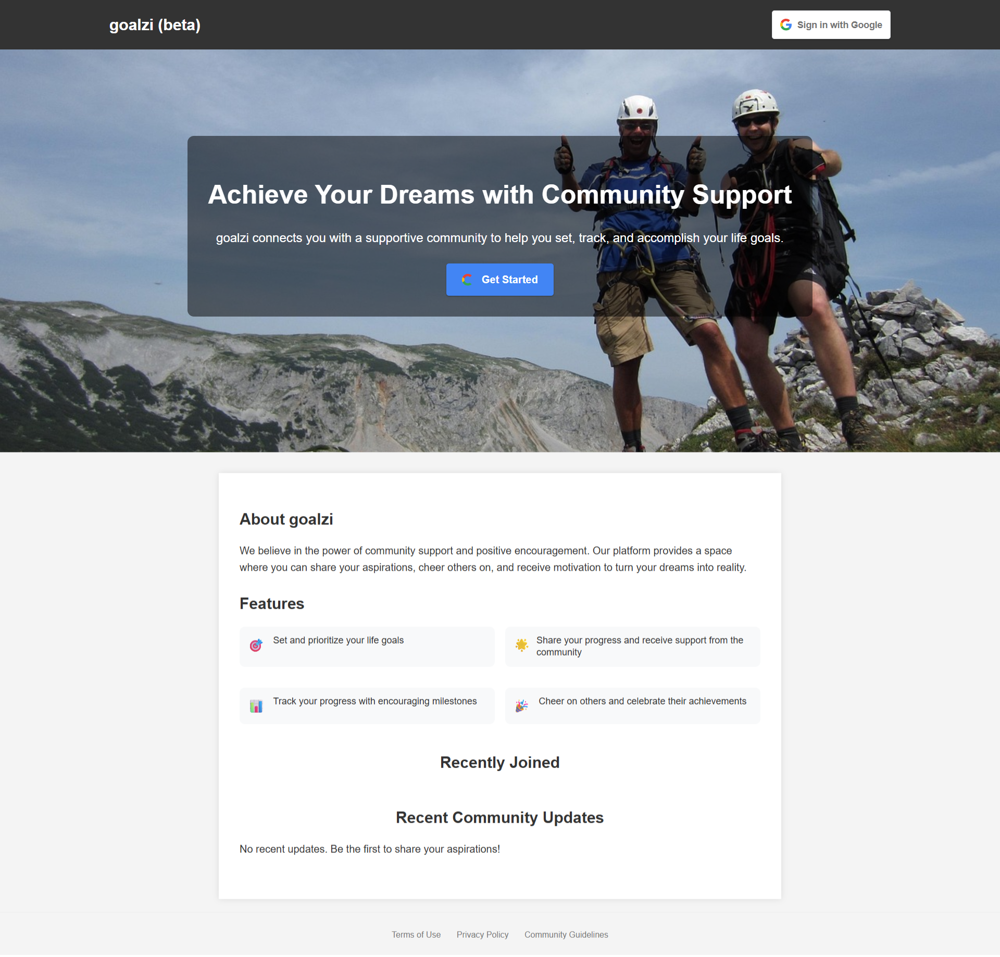
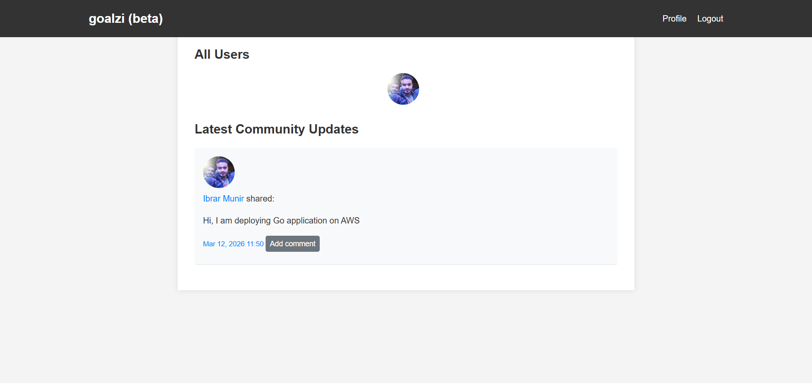
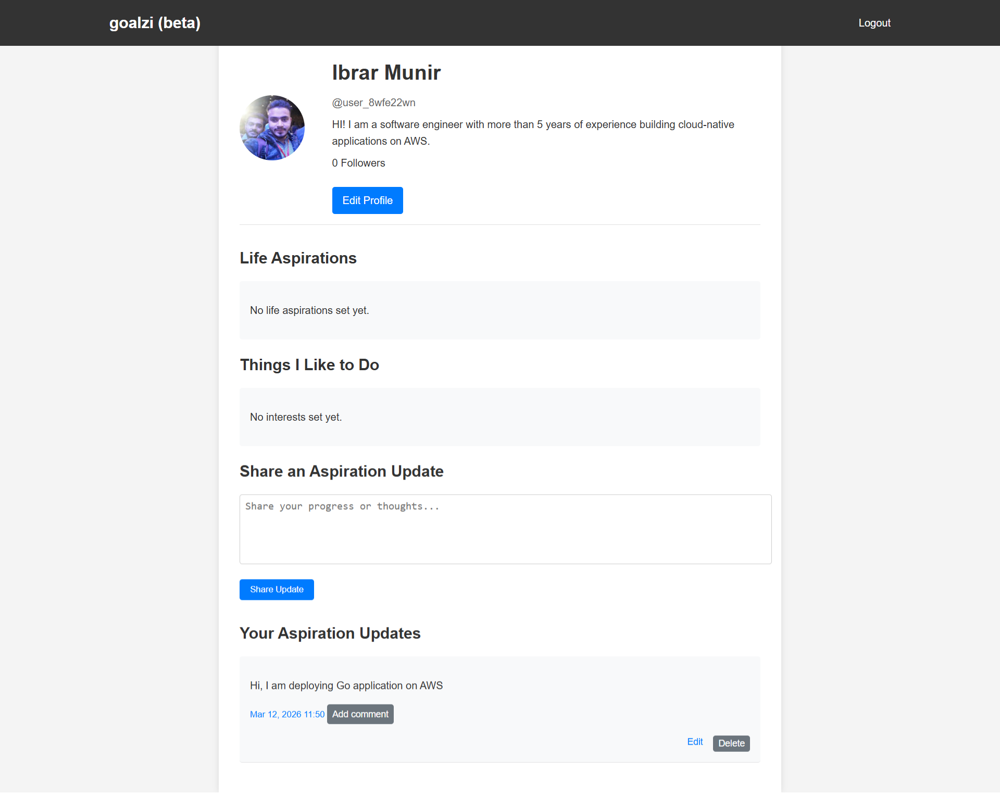
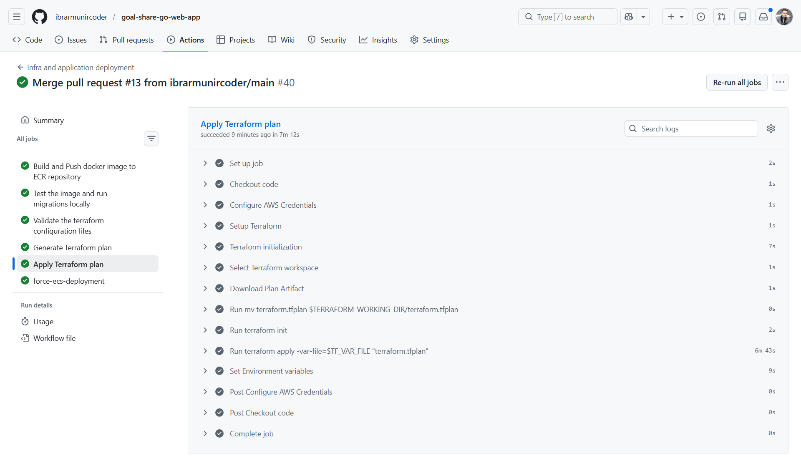
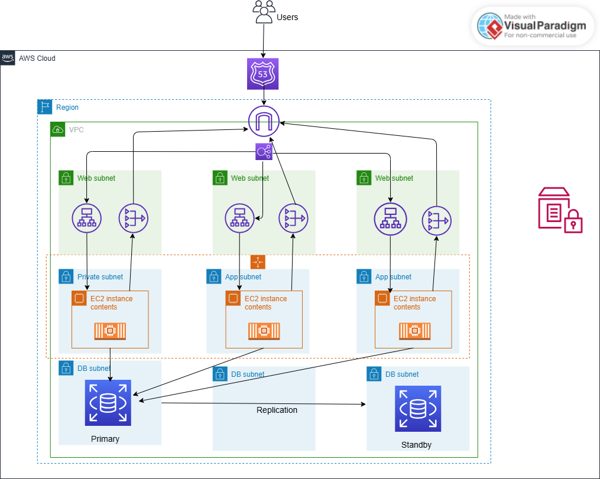

## Go web application deployment on AWS ECS using terraform

Production-ready deployment of a Go web application on AWS ECS (EC2 launch type) using Terraform, with automated CI/CD pipelines powered by GitHub Actions.

---

### 🎬 Live Demo:

---

### 📌 Project Overview:

This project demonstrates how to design and deploy a **production-ready cloud infrastructure** for a Go web application using AWS and Terraform.

The infrastructure follows **cloud-native best practices** including containerization, infrastructure as code, automated deployments, high availability, and secure secret management.

The application itself is a platform where users can **set, track, and share life goals and aspirations**.

The entire system is deployed using **Terraform modules and workspaces**, enabling multiple environments such as **development, staging, and production**.

---

### Architecture Diagram:

---

### 🚀 Key Features

- Containerized Go web application using a multi-stage Docker build approach to reduce image size and improve build efficiency
- Three VPC subnets to isolate application components for scalability and security
- Web Subnet for Application load balancer, App Subnet for Go application instances, and database subnet for RDS postgres
- Deployment across multiple Availability Zones for disaster recovery and high availability
- Automatic scaling of EC2 instances using Auto scaling group (ASG) scaling policy based on certain CPU threshold
- Self-managed ECS infrastructure using Auto scaling group as a capacity provider
- Rolling deployment strategy to release new versions of the application without downtime
- AWS Systems Manager Parameter Store used as an application configuration manager to securely store sensitive values and environment variables
- Amazon RDS PostgreSQL Multi-AZ deployment for improved reliability and failover support
- Application Load Balancer (ALB) for exposing the application and improving availability, scalability, and traffic distribution
- NAT gateway to allow Go application instances located in private app subnet to access internet-based resources
- Automated infrastructure provisioning using Terraform following Infrastructure as Code (IaC) best practices
- CI/CD pipelines implemented with GitHub Actions to automate build, test, and deployment processes
- Terraform modules used for better organization, reusability, and maintainability of infrastructure components
- Terraform workspaces to support multiple environments (dev, staging, production)
- Secure authentication between GitHub Actions and AWS using OIDC, eliminating the need for long-lived AWS credentials

---

### 🚧 Challenges:

- Resolved the container host port conflict issue when running multiple containers on a single instance by using the ECS dynamic host port feature
- Fixed the Application Load Balancer target group health check failure by adding a security group rule for the dynamic port range, which occurred due to the use of dynamic host ports

---

### 🎯 Learning Objectives:

- Learn how to containerize a Go application
- Understand how to run a Go application application locally
- Understand how to use Terraform workspaces
- Implement terraform workspaces for different application environments
- Learn how to use AWS ECS as a container orchestration platform
- Understand different AWS ECS infrastructure modes (EC2 lunch type, Fargate)
- Learn how to run Go database migrations automatically without manual intervention or logging into a jumpbox server
- Understand how to use multiple capacity providers (Fargate, Fargate Spot, EC2, EC2 Spot instances, etc.) within an ECS cluster
- Implement CI/CD pipelines using Github Actions
- Learn how to update the container image URI in the ECS task definition with the latest version
- Learn how to trigger a new ECS deployment after building, testing, and updating infrastructure

---

### 🔗 Useful Resources:

1- https://oneuptime.com/blog/post/2026-02-23-create-target-tracking-scaling-policies-in-terraform/view
2- https://oneuptime.com/blog/post/2026-02-12-ecs-capacity-providers/view
3- https://oneuptime.com/blog/post/2026-02-23-how-to-use-the-cidrsubnets-function-in-terraform/view
4- https://medium.com/@vladkens/aws-ecs-cluster-on-ec2-with-terraform-2023-fdb9f6b7db07

---

### 👨‍💻 Connect with me:

**Ibrar Munir**

Github: https://github.com/ibrarmunircoder  
LinkedIn: https://www.linkedin.com/in/ibrar-munir-53197a16b  
Portfolio: https://ibrarmunir.d3psh89dj43dt6.amplifyapp.com
